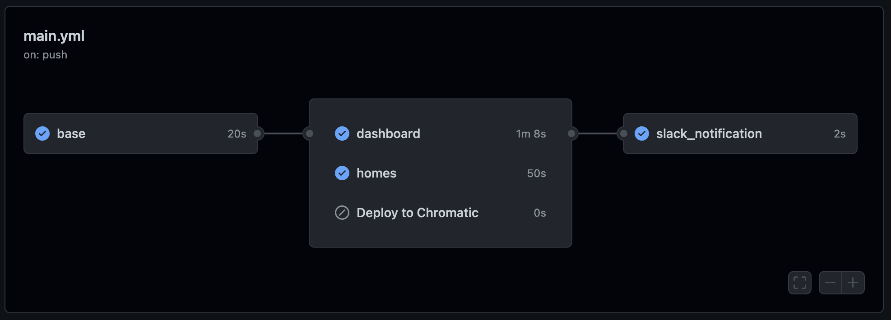

在 monorepo project 裡面遇到需要覆用在 github action 中下載安裝好的 dependencies 來部署不同 subproject，而且希望能依照改動的檔案做出對應的部署。
例如只改了第三個 subproject，就只部署第三個。

monorepo 結構

```
────────── root
  ├─ project
  |   ├─ main-app
  |   ├─ second-app
  |   ├─ third-app
  |   └─ shared
  |
  └─ node_modules
```

這些子專案共用同一個 `node_modules`

目前最簡單的標配 flow 通常會是：

1. `actions/checkout`
1. `actions/setup-node`
1. `actions/cache`
1. Install dependencies & config
1. Run build & deploy
1. if `branch` === `production`，build & deploy to `production`.
1. if `branch` === `staging`，build & deploy to `staging`.

而我的情境是：
三個 app project 各有 `production` 跟 `staging` 的部屬，
shared 自己有 storybook 的部屬，
總計七個部署全都共用同一個 `node_modules`。

雖然單一個 `job` 就能解決

```yml
jobs:
  build_and_deploy:
    runs-on: ubuntu-latest
    steps:
      - uses: actions/checkout
      - uses: actions/setup-node
      - uses: actions/cache

      - name: Install dependencies
        if: steps.cache.outputs.cache-hit != 'true'
        run: npx lerna bootstrap

      - name: Deploying main-app to production
        if: ${{ github.ref == 'refs/heads/main' }}
        run: ...
      - name: Deploying main-app to staging
        if: ${{ github.ref == 'refs/heads/staging' }}
        run: ...

      - name: Deploying second-app to production
        if: ${{ github.ref == 'refs/heads/main' }}
        run: ...
      - name: Deploying second-app to staging
        if: ${{ github.ref == 'refs/heads/staging' }}
        run: ...

      - name: Deploying storybook
        run: ...
```

簡單暴力，但是因為唯一的判斷只有*判斷是 `main branch` 還是 `staging branch`* 只是稍稍改動，幾乎全部都要執行一次，很浪費時間額度，而且每次部署 step 會排隊，時間也被拖得很長。

希望可以改成這樣：

1. 檢查 package-lock 有沒有變動
   1. 有，重新下載安裝 node_modules，並且 cache
   1. 沒有，直接拿出 cache
1. **檢查檔案變動路徑**是否包含以下。
   有的話，檢查 branch 是 `main` or `staging`，再 build & deploy 到相對應位置
   1. `apps/main-app`
   1. `apps/second-app`
   1. `apps/shared`

其實邏輯只多了一個**檢查檔案變動路徑**，
但是

1. 似乎不能直接在 `step` 裡做到這樣的判斷，
1. 檔案變動路徑似乎只能從整個 `workflow` 的 `on` 去做設定

所以想要精緻的控制，可能要拆成多個 `job`，由一個 `workflow` 來統整。

先上做好的樣子


main.yml 裡面包涵了 5 個 job，其中 3 個會是並行的，這樣如果各個專案都要重新 build，就不會排隊，減少整體的部屬速度。

Github action 原本的設定環境是沒有辦法做到在 `job` level 檢查變動的檔案路徑，必須依靠 [dorny/paths-filter](https://github.com/dorny/paths-filter)，可以在 github action - market place 找到它。

```yml
# main.yml
name: CI/CD
on:
  # 設定要觸發這個 workflow 的 event
  # https://docs.github.com/en/actions/using-workflows/triggering-a-workflow
  push:
    branches:
      - main
      - staging
    paths:
      - "apps/**"
      - "apps/shared/**"
      - "libs/api/**"
      - "**/package.json"
      - "**/package-lock.json"
      - ".env*"
      - "!**/README.md"
  # 可以手動觸發 workflow 的設定
  # https://docs.github.com/en/actions/using-workflows/events-that-trigger-workflows#workflow_dispatch
  workflow_dispatch:
```

```yml
# 第一個 job
base:
  runs-on: ubuntu-latest
  outputs:
    # 找 steps 底下 id 為 path-condition 的 outputs
    dashboard: ${{ steps.path-condition.outputs.dashboard }}
    homes: ${{ steps.path-condition.outputs.homes }}
    storybook: ${{ steps.path-condition.outputs.storybook }}
    RESTORE_KEYS: ${{ steps.create_key.outputs.key }}
  steps:
    - uses: actions/checkout@v3
    - uses: actions/setup-node@v3

    # 不是必要，但我想要把重複使用的值抽出來
    - name: Create RESTORE_KEYS
      id: create_key
      env:
        # hashFiles 是 github action 提供的 build-in function，可以拿到這個版本的檔案獨一無二的 hash
        RESTORE_KEYS: ${{ runner.os }}-${{ hashFiles('**/package-lock.json') }}
      # define output 給 job 的方法
      # https://docs.github.com/en/actions/using-jobs/defining-outputs-for-jobs
      run: echo "key=$RESTORE_KEYS" >> "$GITHUB_OUTPUT"

    # cache node_modules
    # https://github.com/actions/cache
    - name: Cache dependencies
      id: cache-dependencies
      uses: actions/cache@v3
      with:
        path: "**/node_modules"
        key: ${{ steps.create_key.outputs.key }}
        restore-keys: ${{ steps.create_key.outputs.key }}

    # install dependencies if the cache did not hit
    - name: Install dependencies
      if: ${{ steps.cache-dependencies.outputs.cache-hit != 'true' }}
      run: npx lerna bootstrap

    # https://github.com/dorny/paths-filter
    # 設定 filter，output 會回傳 boolean
    - name: Path condition
      uses: dorny/paths-filter@v2.11.1
      id: path-condition
      with:
        filters: |
          dashboard:
            - apps/main-app/**
            - 'apps/shared/{asset,composable,config,plugin,util}/**'
            - '.env.*'
          homes:
            - 'apps/homes/**'
            - 'apps/shared/{asset,composable,config,plugin,util}/**'
            - '.env.*'
          storybook:
            - 'apps/shared/**'
```

```yml
# 第二,三,四...個 job
homes:
  # 設定 needs，接受 string | string[]
  # 這代表需要等待 id 為 base 的 job 執行完畢後再執行
  # 多個 job 同時存在一個 workflow 預設會是並行的
  needs: base
  runs-on: ubuntu-latest
  # 用剛剛 base 的 output 來判斷要不要執行 homes job
  if: ${{ needs.base.outputs.homes == 'true' }}
  steps:
    - uses: actions/checkout@v3
    # 和一般使用 acion/cache 不太一樣，這裡指定使用 actions/cache/restore
    # 差異在於 不會執行 post 階段的事情，單純取出 cache
    # 在 base job 已經確定 node_modules 的 cache 一定會存在
    - uses: actions/cache/restore@v3
      id: cache-dependencies
      with:
        path: "**/node_modules"
        key: ${{ needs.base.outputs.RESTORE_KEYS }}

    # deploy to where 步驟其實重複，可以再包裝一層，但考量可能會有修許變動就沒有做這件事情了。
    - name: Deploying to production
      if: ${{ github.ref == 'refs/heads/main' }}
      run: ...

    - name: Deploying to staging
      if: ${{ github.ref == 'refs/heads/staging' }}
      run: ...
```

```yml
slack_notification:
  # 必須等待 base, dashboard, homes, storybook 都執行完了再執行
  needs: [base, dashboard, homes, storybook]
  # 但是 dashboard, homes, storybook 可能會有被 skip 的情況
  # 設定 always() 可以保證一定會執行
  # 在 if 裡面可以不必再用 ${{ }} 來呈現表達式
  if: always()
  runs-on: ubuntu-latest
  steps:
    # 發通知，可以去看更更更之前的文章
    # Github Action 加入 Slack 通知 - Lo
```

```yml
# 整個組裝起來大概會是這樣
name: CI/CD
on:
  push:
    branches: ...
    paths: ...
  workflow_dispatch:
jobs:
  base: ...
  dashboard: ...
  homes: ...
  something: ...
  slack_notification: ...
```
