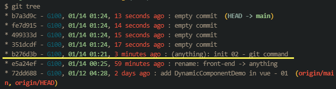
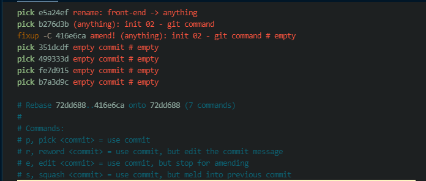
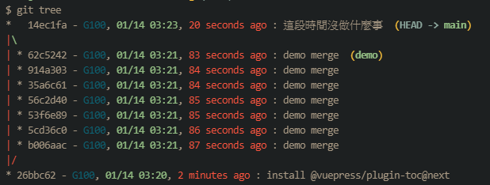

# 好用的、方便的 git command

紀錄幾個我個人**非常**常用的 git command、vscode 操作。
額外花了時間從 git doc, vscode doc 裡面挖掘這些指令、操作非常值得，
分享出來。

[[toc]]

## `-h` / `--help`

第一個肯定要列這個的，
很多地方很多情況都可以 `git -h`, `git add -h`, `git rebase -h`，
想要獲得什麼說明的最快方式。

## `git add -u`

用途: 把已經**被追蹤**的修改，加到 staging

如果一次修改了不少檔案、而且都是要加到這次 commit 的，
我會使用 `git add -u` 而不是 `git add -A`，
原因是我自己偶爾會寫一些很簡單、單純的測試、驗證自己的想法對不對的檔案，
這些檔案狀態是 **Untracked**，


如果是 `git add -A` 就會一併把 Untracked 的檔案加進去了。

## `git commit --amend`

用途: 把 staging 的東西修改到上一次的 commit。

常常會不小心把不該 commit 進去的程式碼、檔案不小心加到這次的 commit 裡面去，
或者不小心漏掉幾句程式碼、檔案要 commit，
這時候可以使用這個，直接加到上一次到 commit。

如果 commit message 沒有要修改，只是修改內容的話，可以再加上 `--no-edit`
變成

```
git commit --amend --no-edit
```

## 連續技: `git commit --fixup=amend:<commit hash>` + `git rebase -i --autosquash --autostash`

用途: 產出一個新的、有標記的 commit，在 git rebase 時，git 會認得這個標記，然後把它放到正確的位置上。

:::warning 溫馨小提醒
下面所有 git tree 是自定義的 `git log` alias，
喜歡的話可以自己拿去改，我也是從 [Chris](https://dwatow.github.io/) 大大那裡偷來的

```
alias.tree=log -20 --pretty=format:"%h - %Cblue%an%Creset, %Cgreen%ad%Creset, %Cred%ar%Creset : %s %C(auto)%d %w(0,6,6)%+b" --graph --date=format:"%m/%d %H:%M"
```

至於參數該怎麼放，請參閱 [git scm - pretty-formats](https://git-scm.com/docs/pretty-formats)
而 `git commit --fixup=amend` 也很長
附上我的 alias

```
alias.fixup=!f() { git commit --fixup=amend:$1; }; f
```

:::



假設我的 git log 長這樣，然後突然發現有東西忘記加進去 b276d3b 這個 commit，
但是發現時已經又多了四個 commit，
這時候已經沒辦法使用 `git commit --amend` 了，
reset 回去再慢慢重複剛剛的 commit 絕對是浪費生命的行為。

這時候請使用 `git commit --fixup=amend:b276d3b` + `git rebase -i --autosquash`
這個**連續技**


(順帶一提 `git commit --allow-empty` 就可以製造出 沒有任何修改的 commit，在教學時很好用 XD)


一樣像是 commit 的流程，只是這次 git 會很貼心的先幫你把相關註解打好，
讓你知道這個 commit 是要用來修改之前 commit 的 commit


`git rebase -i --autosquash`，給他 Enter 下去。



剛剛那個 fixup 的 commit 會自動飛到指定的 commit hash(b276d3b)下面，
你只要輕輕地 儲存、退出，All Done!!


再次 `git log`，可以看到剛剛的 b276d3b 已經被重算過，修改已經加進去了~

我自己還會再加上 `--autostash`，
可以把還沒要 commit 的修改先放到 stash 去，
在執行完 rebase 之後自動 pop 出來
然後設定為 `alias`，方便快速!

:::tip Git alias

```
alias.re=rebase -i --autostash --autosquash
```

:::

:::tip
至於為什麼要這樣整理 commit?
全部 commit 在一起不是更快速嗎~?
我自己的理由是: 為了之後 `git revert` 比較方便，
看 commit 一條一條看 code 這種事情我自己是還沒做過啦 XD
但是在 revert 上很有感，
偶爾會面臨到

- 不確定這樣寫好不好
- 可能這次改了，下次還要再改回來

的情況，上述這些有可能就會用到 `git revert` 來快速回復，
這時候一個 commit 都是相關邏輯而且細小，改動起來就會非常方便。
:::

## `git log --grep='message'`

用途: 找特定 title 的 commit

message 的部分如果只是"單詞"，可以不必加 `'` / `"`
如果中間還有空白就必須加上 `'` / `"`

在茫茫 commit 大海裡千萬不要用目視的一行一行找過往的 commit 吶........

## `git branch -vv`

用途: 列出目前 local branch 對應到 remote branch 的位置


如上圖，現在 local branch 的 main 對應到 remote branch 的 origin/main，
而且領先了 2 個 commit 還沒被 push，
commit message 的 title 是 "(anything): init 02 - git command"

## `git merge --no-ff --no-commit`

用途: merge 時強制不要 ff (Fast forward)，也不要直接就把預設的 merge message 給 commit 進去。

如果你的 commit 習慣跟我一樣 **零碎** 的話，
好像可以採用看看?
不使用 ff 模式可以在 commit 支線圖多出一條線
然後再簡單的描述這個**區間**做了什麼事情，
我覺得有助於自己過了幾個禮拜後回頭看看自己做了什麼進度。

(但如果壓根不會想要回頭看的話，這個方式絕對是多此一舉 😆)



## git 其實有自動補齊指令的功能

像是 `git reset --hard`，其實可以 `git reset --h` 就可以了，
只要 git 能找到單一符合的結果，就可以不必把後面的字全部打完。

---

下面這邊也是關於 git 操作，但是是使用 vscode 的介面來操作。

## Vscode command - `Git: Stage Selected Ranges`


過往我會使用 `git add -p` 或者 `git add -i`
去細膩的挑出我這次要 commit 的內容，但很麻煩

直接用 vscode command 直接框選你要加入 staging 的行數，shift + 上下左右、滑鼠拖曳選擇...怎樣都好
沒有反白就會是 光標 所在的位置


(我的 theme 反白太不明顯，就這張換成白色的，這可不是盜圖啊)

然後按下 `F1` (Show all command)，Windows 和 Mac 預設都是 `F1`

:::tip 請參閱 keyboard ref
Mac: [https://code.visualstudio.com/shortcuts/keyboard-shortcuts-macos.pdf](https://code.visualstudio.com/shortcuts/keyboard-shortcuts-macos.pdf)

Windows: [https://code.visualstudio.com/shortcuts/keyboard-shortcuts-windows.pdf](https://code.visualstudio.com/shortcuts/keyboard-shortcuts-windows.pdf)
:::

輸入 'git' 會看到


選擇 `Git: Stage Selected Ranges` 給他 Enter 下去

你所選取的範圍就加進 staging 裡面了~~
**這個超級無敵好用!! 請善用!!**

當然其他有各式各樣上百種 command 也可以自己玩玩看，
就不一一介紹了，超多超方便還不必記 keyboard shortcut!!
