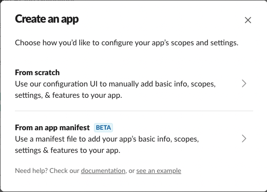
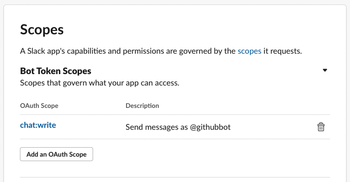
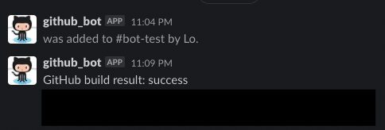

# 怎麼在 Github action flow 運作時，發送訊息到 Slack Channel?

工作中接到的任務：要在每次 push、deploy 的 github action 裡面加入 Slack bot 在指定 Slack Channel 出現通知。

Slack 官方其實已經做出很多 integration/api 可以使用，
之前公司的前輩是使用，[rtCamp 做的 Github action](https://github.com/rtCamp/action-slack-notify)
用的是 [Incoming WebHooks](https://lubn.slack.com/apps/A0F7XDUAZ-incoming-webhooks?tab=more_info) 這個 Slack app。

而換我要來建置新專案的時候看到這段

> Please note, this is a legacy custom integration - an outdated way for teams to integrate with Slack. These integrations lack newer features and they will be deprecated and possibly removed in the future. We do not recommend their use. Instead, we suggest that you check out their replacement: Slack apps.

雖然沒有說什麼時候會真的被廢棄掉，但想到以後可能又要在設定一次就覺得麻煩，
乾脆一次就先弄好，
所以開始海量搜尋，這種小東西的資源真的都比較少。

找到這個 [Slack api official repo](https://github.com/slackapi/slack-github-action)

採用第二種方式 - Technique 2: Slack App

照著做一次就搞定，
整個設定大概 5 分鐘結束。

以下單純把文件超級簡單翻譯一下

## Technique 2: Slack App

首先要先建立或者使用既有的 Slack app，
用這個 app 來調用 [chat.postMessage](https://api.slack.com/methods/chat.postMessage) API method，

### Setup

- [建立 Slack App][apps]
  
  
  先選擇 `From scratch` 就可以了
- 把 [`chat.write`](https://api.slack.com/scopes/chat:write) 這項 機器人權限範圍（bot scope）加到 **OAuth & Permissions** 底下
  
- 安裝到目標 Slack workspace（Install the app to your workspace.）
- 從 **OAuth & Permissions** 複製 `Bot Token` 然後 [加到 Github repo - secret][repo-secret] 命名為 `SLACK_BOT_TOKEN`。~~當然如果你的 repo 是 `private` 且保證不會有其他人看到，你也可以直接把 token 貼到 github action flow 的 `.yaml` 裡面(?)~~
- 把機器人加到你要發送訊息的 Channel 裡面 (`/invite @bot_user_name`).

### Usage

把這段 Action [step](job-step) 加到你的 GitHub Action Workflow file

```yaml
- name: Post to a Slack channel
  id: slack
  uses: slackapi/slack-github-action@v1.18.0
  with:
    # Slack channel id, channel name, or user id to post message.
    # See also: https://api.slack.com/methods/chat.postMessage#channels
    channel-id: 'CHANNEL_ID'
    # For posting a simple plain text message
    slack-message: "GitHub build result: ${{ job.status }}\n${{ github.event.pull_request.html_url || github.event.head_commit.url }}"
  env:
    SLACK_BOT_TOKEN: ${{ secrets.SLACK_BOT_TOKEN }}
```

可以用 JSON 的格式可以去自訂訊息內容。
在 Slack 的世界裡面這個東西叫 `Block Kit`，
感覺可以做出很多元的東西！！但...如果要快捷一點可以用下面這個 Builder 迅速匯入模板來修改比較不會浪費生命

[Slack Block Kit Builder](https://app.slack.com/block-kit-builder/T92N97FNG)

```yaml
- name: Post to a Slack channel
  id: slack
  uses: slackapi/slack-github-action@v1.16.0
  with:
    # Slack channel id, channel name, or user id to post message.
    # See also: https://api.slack.com/methods/chat.postMessage#channels
    channel-id: 'CHANNEL_ID'
    # For posting a rich message using Block Kit
    payload: |
      {
        "text": "GitHub Action build result: ${{ job.status }}\n${{ github.event.pull_request.html_url || github.event.head_commit.url }}",
        "blocks": [
          {
            "type": "section",
            "text": {
              "type": "mrkdwn",
              "text": "GitHub Action build result: ${{ job.status }}\n${{ github.event.pull_request.html_url || github.event.head_commit.url }}"
            }
          }
        ]
      }
  env:
    SLACK_BOT_TOKEN: ${{ secrets.SLACK_BOT_TOKEN }}
```



[job-step]: https://docs.github.com/en/actions/learn-github-actions/workflow-syntax-for-github-actions#jobsjob_idsteps
[repo-secret]: https://docs.github.com/en/free-pro-team@latest/actions/reference/encrypted-secrets#creating-encrypted-secrets-for-a-repository
[apps]: https://api.slack.com/apps

### 範例

```yaml=
      - name: Post to a Slack channel
        id: slack
        uses: slackapi/slack-github-action@v1.18.0
        with:
          # Slack channel id, channel name, or user id to post message.
          # See also: https://api.slack.com/methods/chat.postMessage#channels
          channel-id: ${{secrets.SLACK_CHANNEL_ID}}

          # For posting a simple plain text message
          # slack-message: 'GitHub build result: ${{ job.status }}\n${{ github.event.pull_request.html_url || github.event.head_commit.url }}'

          # For posting a rich message using Block Kit
          payload: |
            {
              "blocks": [
                {
                  "type": "section",
                  "text": {
                    "type": "mrkdwn",
                    "text": "＿＿＿＿＿ has a new update:\n*<${{secrets.SLACK_URL_PRODUCTION}}|Production>*\t*<${{secrets.SLACK_URL_STAGING}}|Staging>*"
                  }
                },
                {
                  "type": "section",
                  "fields": [
                    {
                      "type": "mrkdwn",
                      "text": "*Branch:* ${{github.ref_name}}"
                    },
                    {
                      "type": "mrkdwn",
                      "text": "*Build result:* ${{ job.status }}"
                    },
                    {
                      "type": "mrkdwn",
                      "text": "*Repo:* ${{github.repository}}"
                    },
                    {
                      "type": "mrkdwn",
                      "text": "*Actor:* ${{github.actor}}"
                    },
                    {
                      "type": "mrkdwn",
                      "text": "*Compare:* ${{github.event.compare}}"
                    }
                  ]
                }
              ]
            }
        env:
          SLACK_BOT_TOKEN: ${{ secrets.SLACK_BOT_TOKEN }}
```

裡面有附上一些 `github action` 特有的 `context`
可以到 [github 官網看文件](https://docs.github.com/en/actions/learn-github-actions/contexts)
