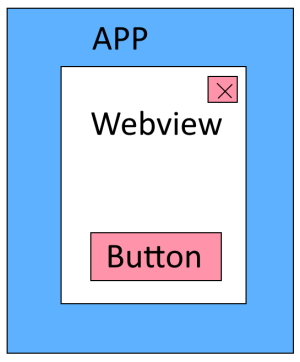
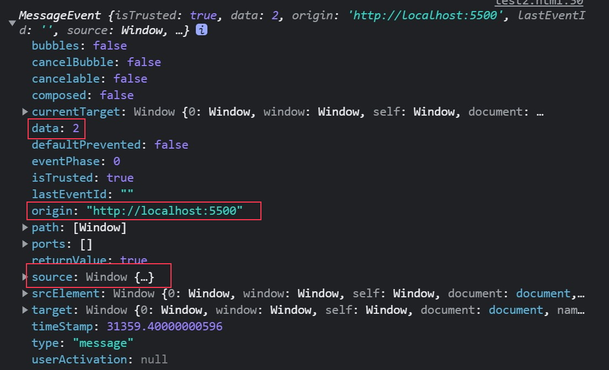

# 在不同窗口之間傳遞資訊 window.postMessage()

因為案子的關係，遇到這樣的情境:



在 app (ios / android) 中嵌入 webview (白色區塊)，
在 webview 中又有需要跟 app 互動的 button (包含右上角的 X)，
紅色的 button 都是需要和 app 互動的。
在畫面上 button 必須是屬於 webview 實作，而邏輯卻又是 app 得負責的。

~~雖然可能可以使用圖層把 webview 夾在中間，讓 button 屬於 app，但...有點糙。~~

#### 這時候可以使用 `window.postMessage()` 在「不同窗口」之間進行「跨來源溝通」

舉例:

1. 你的網頁 <-> iframe 裡的網頁
1. 你的網頁 <-> app ( ios/android )

> The window.postMessage() method safely enables cross-origin communication between Window objects;
> e.g., between a page and a pop-up that it spawned, or between a page and an iframe embedded within it.

---

### 發送方:

```javascript
targetWindow.postMessage(message, targetOrigin);
targetWindow.postMessage(message, targetOrigin, [transfer]);
```

- targetWindow: **目標窗口**
- message: 就是要傳的資料
- targetOrigin: 指定目標窗口的來源，只有在目標窗口的 origin 符合 targetOrigin 所指定時才會作用，
  避免對著錯誤的目標窗口誤傳資訊，**千萬**不要偷懶使用 `*`

> If at the time the event is scheduled to be dispatched the scheme, hostname, or port of targetWindow's document does not match that provided in targetOrigin,
> the event will not be dispatched; only if all three match will the event be dispatched
> **Always provide a specific targetOrigin, not \*, if you know where the other window's document should be located. Failing to provide a specific target discloses the data you send to any interested malicious site.**

### 接收方:

如果接收方是 web，則是用 `addEventListener` 監聽 `message`。

```javascript
// MDN
window.addEventListener(
  "message",
  event => {
    // 驗證來源
    if (event.origin !== "http://example.org:8080") return;
    console.log(event);
  },
  false
);
```



- 用 origin 來驗證來源。
- data 就是傳過來的資訊。
- source 則是發送方，可以輕易地從 source 取得發送方的位置，進而做雙向溝通。

---

可以開啟兩個 local http server 做 Demo

```html
<!-- sender html -->
<body>
  <button id="iframe-button" type="button">iframe page</button>

  <script>
    var btn = document.getElementById("iframe-button");
    btn.addEventListener("click", () => {
      if (!btn.count) btn.count = 0;
      btn.count += 1;
      window.parent.postMessage(btn.count, "http://localhost:5500");
      console.log("clicked!");
    });
  </script>
</body>
```

```html
<!-- reciver.html -->
<body>
  <div>
    <p id="counter" class="counter">0</p>
    <iframe src="http://localhost:5500/test.html" frameborder="0"></iframe>
  </div>

  <script>
    var btn = document.getElementById("iframe-button");
    btn.addEventListener("click", () => {
      if (!btn.count) btn.count = 0;
      btn.count += 1;
      window.parent.postMessage(btn.count, "http://localhost:5500");
      console.log("clicked!");
    });
  </script>
</body>
```
